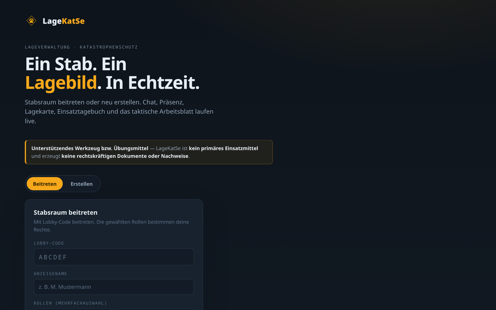
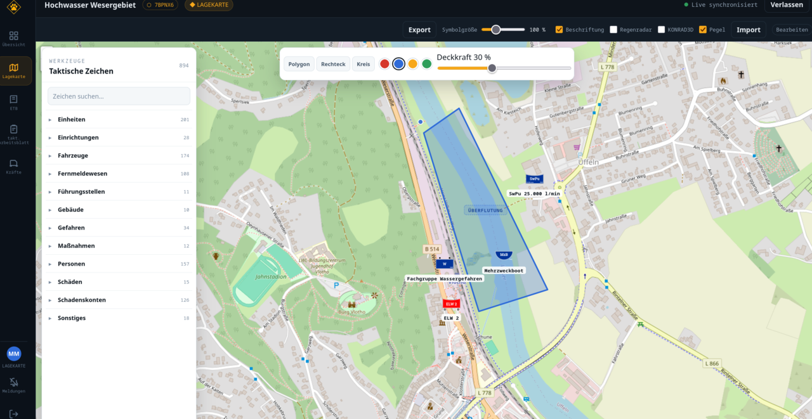
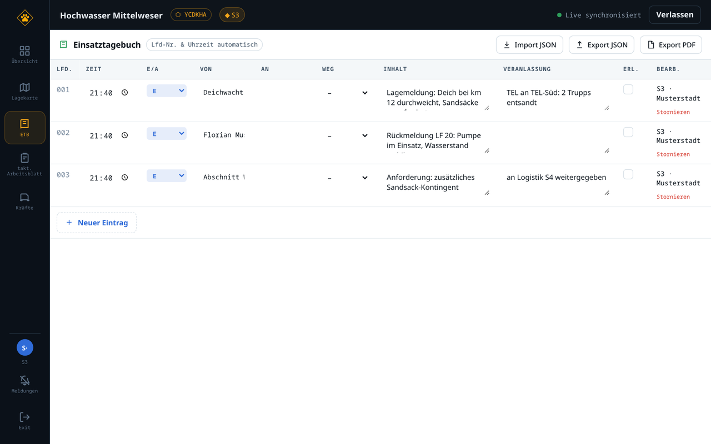
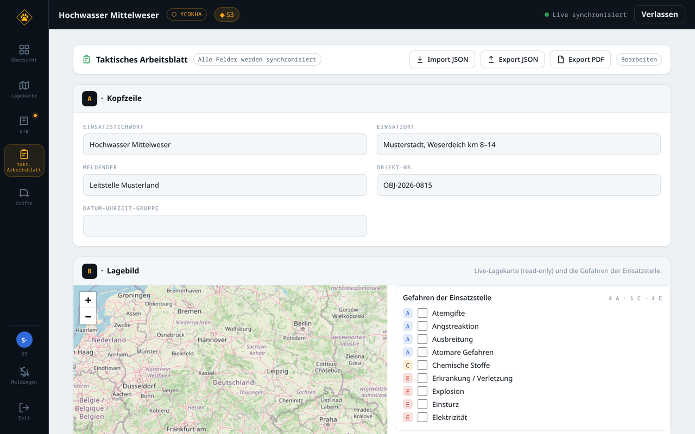
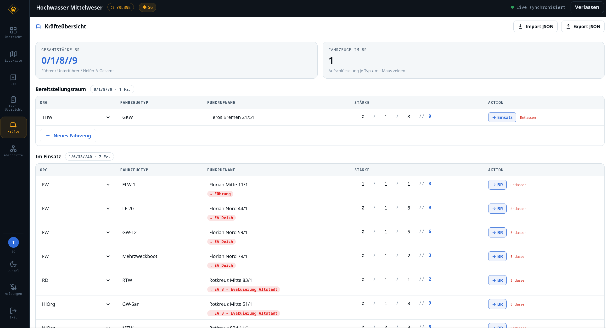

# LageKatSe

**Ein Stab. Ein Lagebild. In Echtzeit.** — LageKatSe ist eine browserbasierte,
kollaborative Lageverwaltung für den Katastrophenschutz-Führungsstab: Lagekarte,
Einsatztagebuch, taktisches Arbeitsblatt und Kräfteübersicht, live synchron für
alle Beteiligten.

> **Unterstützendes Werkzeug bzw. Übungsmittel** — LageKatSe ist **kein primäres
> Einsatzmittel** und erzeugt **keine rechtskräftigen Dokumente oder Nachweise**.



## Was ist LageKatSe?

Mehrere Personen treten über einen Lobby-Code demselben **Stabsraum** bei und
arbeiten gleichzeitig am selben Lagebild — jede Änderung erscheint sofort bei
allen. Wer was ändern darf, bestimmen die gewählten **Rollen** (S1–S6, LdS,
Lagekarten-/ETB-Führer, Leiter BR, Monitor); die Rechte werden **serverseitig**
durchgesetzt. Läuft im Browser, ohne Installation beim Nutzer — im Internet
(HTTPS) genauso wie im geschlossenen Netz/LAN.

> 🎮 **Demo ausprobieren:** Eine öffentliche Testinstanz läuft unter
> **[lagekatse.56kbit.net](https://lagekatse.56kbit.net)** — ohne Installation,
> direkt im Browser. (Übungsbetrieb; Daten werden nach Inaktivität automatisch
> gelöscht. Die Instanz kann sporadisch kurzzeitig nicht erreichbar sein.)

## Funktionen

- **🗺️ Gemeinsame Lagekarte** — Leaflet + OpenStreetMap, die vollständige
  DV-102-Symbolpalette (nach Typ gruppiert, durchsuchbar), Flächen/Bereiche,
  Beschriftungen & Tooltips, Symbol-Ausrichtung. Zuschaltbare Overlays:
  **DWD-Regenradar**, **KONRAD3D**-Gewitterzellen (Zell-Info per Klick) und
  **Pegelstände** der Bundeswasserstraßen (PEGELONLINE/WSV). JSON-Im-/Export und **PDF-Export**.
- **📓 Einsatztagebuch (ETB)** — tabellarisch, mit **server-vergebener,
  lückenloser Lfd-Nr.** und Serverzeit, Live-Feld-Bearbeitung, Storno,
  JSON- und **PDF-Export**.
- **📋 Taktisches Arbeitsblatt** — die IdF-Vorderseite (Felder A–F) live-synchron,
  Gefahren-Randfelder, Feld B als eingebettete Live-Lagekarte, **Wetter-Rückseite**
  (DWD/Bright Sky). JSON-Im-/Export und PDF-Export.
- **🚒 Kräfteübersicht** — Bereitstellungsraum ↔ Im Einsatz, Stärke nach **DV 100**
  mit automatischer Summierung; Verschieben/Entlassen wird ins ETB protokolliert.
- **💬 Übersicht, Präsenz & Chat** — wer ist online, Stabsraum-Chat, und
  **Aktivitäts-Hinweise** (Punkt am Rail + Zähler im Browser-Tab; optionale
  Desktop-Benachrichtigungen bei HTTPS/localhost).
- **📦 Gesamt-Export & Bundle-Import** — den kompletten Stabsraum als ZIP sichern
  und wieder einspielen. **Lage abschließen** erzeugt einen Abschluss-Eintrag,
  exportiert alles und löscht den Raum.

<table>
  <tr>
    <td width="50%"><br><sub><b>Lagekarte</b> — DV-102-Palette & Overlays</sub></td>
    <td width="50%"><br><sub><b>Einsatztagebuch</b> — lückenlose Lfd-Nr., Live-Edit</sub></td>
  </tr>
  <tr>
    <td width="50%"><br><sub><b>Taktisches Arbeitsblatt</b> — Felder A–F + Lagebild</sub></td>
    <td width="50%"><br><sub><b>Kräfteübersicht</b> — BR/Einsatz, Stärke nach DV 100</sub></td>
  </tr>
</table>

## Loslegen

### A) Schnell ausprobieren (lokal)

Voraussetzung: **Node ≥ 20** und **pnpm** (`npm i -g pnpm` oder via corepack).

```bash
pnpm install
pnpm dev
```

Web-App im Browser öffnen: **http://localhost:5173** (Backend läuft auf `:8080`).
Ohne weitere Konfiguration nutzt der Server einen **In-Memory-Store** (keine
Persistenz über Neustarts — ideal zum Ausprobieren). Zum Testen einfach in zwei
Browserfenstern denselben Lobby-Code beitreten und die Live-Synchronisation
beobachten.

### B) Produktivbetrieb mit Docker (empfohlen)

Es gibt fertige Container-Images auf der GitHub Container Registry (GHCR) —
kein Klonen, kein Bauen nötig. Man braucht nur zwei Dateien plus eine `.env`:

```bash
# 1) Deploy-Dateien holen:
curl -O https://raw.githubusercontent.com/gergernaut/LageKatSe/main/docker-compose.yml
curl -O https://raw.githubusercontent.com/gergernaut/LageKatSe/main/Caddyfile

# 2) .env anlegen und mindestens setzen:
#   DOMAIN=lagekatse.example.org      # öffentliche Domain (für Let's-Encrypt)
#   CADDY_EMAIL=admin@example.org     # Let's-Encrypt-Benachrichtigungen
#   JWT_SECRET=<starkes, zufälliges Passwort>
#   POSTGRES_PASSWORD=<sicheres Passwort>
#   # optional: LAGEKATSE_IMAGE_TAG=0.6.1   (Version festnageln; Default latest)

# 3) Ziehen und starten:
docker compose pull
docker compose up -d
```

Der mitgelieferte **Caddy**-Reverse-Proxy terminiert TLS und routet `/api` +
`/sync` ans Backend, `/` an die Web-App. Bei öffentlicher Domain holt Caddy
automatisch ein **Let's-Encrypt**-Zertifikat → die App ist unter
`https://<DOMAIN>` erreichbar.

**Dual-Mode:** Für ein **geschlossenes Netz/LAN** ohne öffentliches DNS im
`Caddyfile` `tls internal` (selbstsigniert) aktivieren oder `DOMAIN=:80` für
einfaches HTTP setzen — die einfachste Variante für den Übungsbetrieb.

**Aus dem Quellcode bauen** (statt Images zu ziehen):

```bash
docker compose -f docker-compose.yml -f docker-compose.build.yml up -d --build
```

**Grundkarte anpassen** (optional, z. B. eigener Tile-Server im geschlossenen
Netz): `config.js.example` nach `config.js` kopieren, `tileUrl` setzen und im
`web`-Service den Volume-Mount `./config.js:/srv/config.js:ro` aktivieren. Einen
**eigenen Tile-Server** für Offline-/geschlossene Netze richtet
[`docs/tiles.md`](docs/tiles.md) ein (optionales `--profile tiles`).

### Konfiguration (`.env`)

Alle Einstellungen kommen aus einer `.env` im Repo-Root (`cp .env.example .env`).
Die wichtigsten Werte:

| Variable | Zweck |
|----------|-------|
| `JWT_SECRET` | Signiert die Session-Tokens — **unbedingt** setzen |
| `DATABASE_URL` | Postgres-URL für dauerhafte Räume (leer = In-Memory) |
| `DOMAIN` / `CADDY_EMAIL` | öffentliche Domain + Let's-Encrypt (Docker-Deployment) |
| `POSTGRES_PASSWORD` | DB-Passwort (Docker-Deployment) |
| `CORS_ORIGIN` | Origin der Web-App (bei Same-Origin hinter dem Proxy unkritisch) |
| `VITE_API_URL` | Backend-URL für den Browser; leer = Same-Origin |
| `RETENTION_DAYS` | Inaktive Räume werden nach dieser Frist automatisch gelöscht |

Details und alle Variablen: siehe [`.env.example`](./.env.example).

## Datenquellen & Lizenzen

LageKatSe bindet mehrere externe Datenquellen ein — die Attributionen erscheinen
in der App und sind in der [`NOTICE`](./NOTICE)-Datei gebündelt:

- **Kartenkacheln/Geodaten:** © OpenStreetMap-Mitwirkende (ODbL)
- **Regenradar, KONRAD3D, Wetter:** Deutscher Wetterdienst (DWD), teils via Bright Sky
- **Pegelstände:** Wasserstraßen- und Schifffahrtsverwaltung des Bundes (WSV) / PEGELONLINE
- **Taktische Zeichen:** [jonas-koeritz/Taktische-Zeichen](https://github.com/jonas-koeritz/Taktische-Zeichen), gemeinfrei (CC0)
- **Schriftart (PDF):** DejaVu Sans (permissive)

## Für Entwickler

- **Architektur & Fachkonzept:** [architecture.md](./architecture.md) — Yjs/CRDT
  über WebSocket, autoritativer Server (kein P2P), ein Dokument pro Raum×Modul.
- **Bau-/Verhaltensregeln für Beiträge:** [AGENTS.md](./AGENTS.md).
- **Monorepo (pnpm):** `packages/shared` (Rollen/Rechte/Datenmodelle),
  `packages/server` (Fastify + WebSocket-Gateway + Persistenz),
  `packages/web` (React/Vite-SPA).

| Befehl | Wirkung |
|--------|---------|
| `pnpm dev` | Server + Web parallel (Hot-Reload) |
| `pnpm dev:server` / `pnpm dev:web` | nur Backend / nur Frontend |
| `pnpm typecheck` | TypeScript-Prüfung über alle Pakete |
| `pnpm build` | Produktions-Build (Web) |
| `pnpm test` | Unit-Tests (Vitest) |
| `pnpm db:up` / `pnpm db:down` | PostgreSQL via Docker starten/stoppen |

## Lizenz

[Apache-2.0](./LICENSE) — © 2026 LageKatSe contributors. Dritt-Attributionen
siehe [`NOTICE`](./NOTICE).
