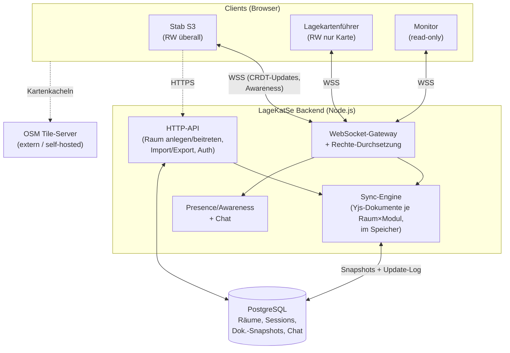
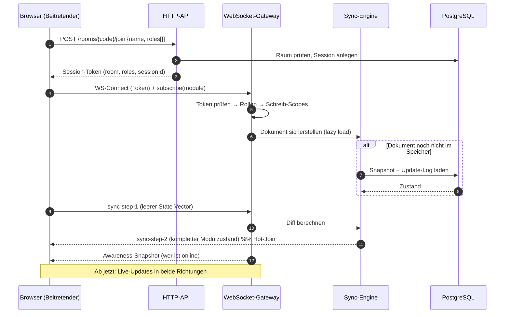
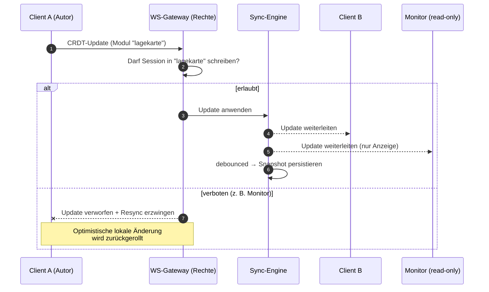
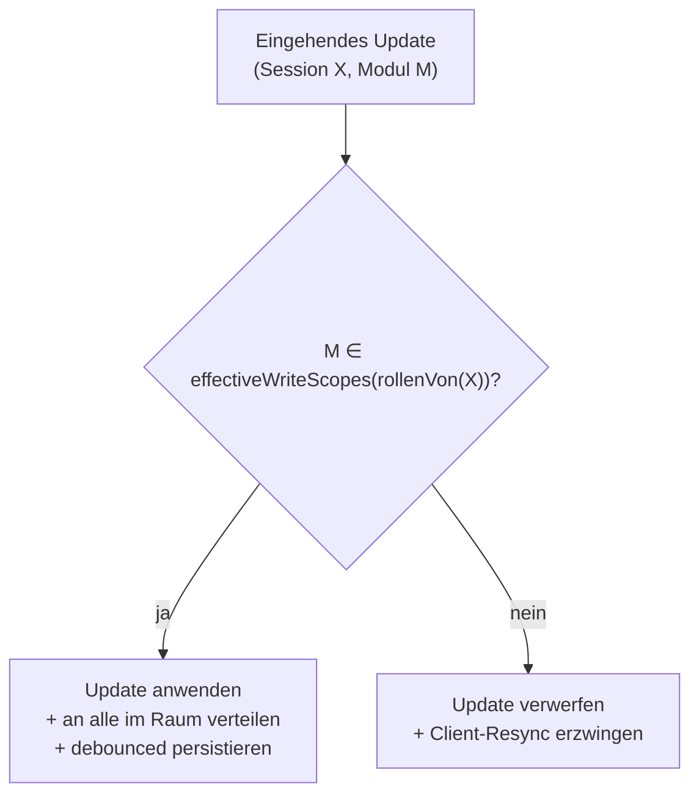
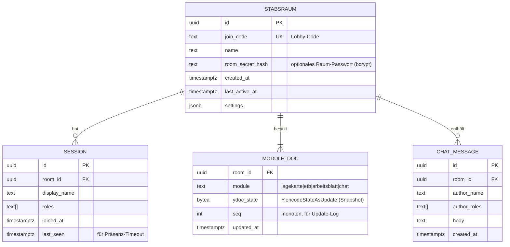
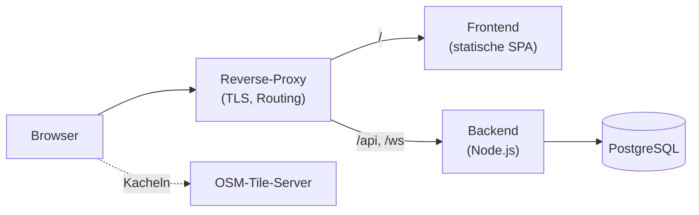

# LageKatSe – Architektur- und Fachkonzept

> Modulare, browserbasierte Multi-User-Lageverwaltung für den Katastrophenschutz.
> Version 0.2 · Stand: 2026-07-30 · Konzept + Umsetzungsstand bis **M1 (Lagekarte)**

Dieses Dokument überführt das Brainstorming (`LageKatSe.txt`) in ein tragfähiges technisches Konzept.
Es beschreibt Zielbild, Architektur, Datenmodell, Rechtemodell und einen Umsetzungsfahrplan.
Fachliche Annahmen, die noch mit der Zielgruppe (Feuerwehr/THW/Hilfsorganisation) validiert werden
sollten, sind mit **⚠️ zu klären** markiert.

---

## Inhalt

1. [Zielbild & Leitplanken](#1-zielbild--leitplanken)
2. [Fachglossar](#2-fachglossar)
3. [Architekturüberblick](#3-architekturüberblick)
4. [Technologie-Stack (Entscheidungen)](#4-technologie-stack-entscheidungen)
5. [Echtzeit-Synchronisation & Hot-Join](#5-echtzeit-synchronisation--hot-join)
6. [Rollen- & Rechtemodell](#6-rollen--rechtemodell)
7. [Datenmodell](#7-datenmodell)
8. [Modul 1 – Gemeinsame Lagekarte](#8-modul-1--gemeinsame-lagekarte)
9. [Modul 2 – Gemeinsames Einsatztagebuch](#9-modul-2--gemeinsames-einsatztagebuch)
10. [Modul 3 – Taktisches Arbeitsblatt](#10-modul-3--taktisches-arbeitsblatt)
11. [Präsenz & Chat](#11-präsenz--chat)
12. [Import & Export](#12-import--export)
13. [Persistenz, Recovery & Skalierung](#13-persistenz-recovery--skalierung)
14. [Sicherheit & Datenschutz](#14-sicherheit--datenschutz)
15. [Nicht-funktionale Anforderungen](#15-nicht-funktionale-anforderungen)
16. [Deployment](#16-deployment)
17. [Offene Entscheidungen](#17-offene-entscheidungen)
18. [Umsetzungs-Roadmap](#18-umsetzungs-roadmap)
19. [Vorgeschlagene Projektstruktur](#19-vorgeschlagene-projektstruktur)

---

## 1. Zielbild & Leitplanken

**LageKatSe** ist eine Web-Anwendung, mit der ein Führungsstab (bzw. eine Einsatzleitung) eine
gemeinsame Lage kollaborativ und in Echtzeit führt – ohne Client-Installation, ausschließlich im
Browser. Mehrere Nutzer arbeiten gleichzeitig in demselben virtuellen **Stabsraum** und sehen
Änderungen der anderen sofort.

### Leitplanken (nicht verhandelbare Eigenschaften)

| # | Leitplanke | Konsequenz für die Architektur |
|---|------------|-------------------------------|
| L1 | **Echtzeit** – alle Änderungen sofort bei allen sichtbar | Server-vermittelte Live-Synchronisation, kein Reload |
| L2 | **Hot-Join jederzeit** – Beitretende sehen sofort den vollständigen Stand | Der komplette Zustand ist jederzeit rekonstruierbar (CRDT + Snapshot) |
| L3 | **Persistenz** – Stabsräume überleben Neustarts, inkl. aller Modul-Zustände | Serverseitige, dauerhafte Speicherung des Zustands |
| L4 | **Rollenbasierte Rechte**, bei Mehrfachrollen additiv zusammengeführt | Autoritative Rechtedurchsetzung serverseitig, feingranular pro Modul |
| L5 | **Modularität** – Unter-Anwendungen sind unabhängig erweiterbar | Modul = eigener Zustands-Namespace + eigene Rechte-Scope |
| L6 | **Einsatztauglichkeit** – funktioniert auch bei schlechter Konnektivität | Offline-Cache im Client, robuster Reconnect/Resync |

> **Kontext:** LageKatSe ist ein Führungs- und Übungswerkzeug. Es ersetzt kein
> zertifiziertes Leitstellen-/ELS-System und trifft keine automatisierten Einsatzentscheidungen.
> Das entlastet uns von harten Echtzeit-/Ausfallsicherheits-Zertifizierungen, verpflichtet uns aber
> zu sauberer Dokumentation (Einsatztagebuch ist ein nachvollziehbares Führungsdokument).

---

## 2. Fachglossar

Damit Code und Konzept dieselbe Sprache sprechen (Domänenbegriffe bleiben deutsch, Code-Identifier
englisch, wo sinnvoll):

| Begriff | Bedeutung | Interner Name (Code) |
|---------|-----------|----------------------|
| **Stabsraum** | Persistenter Mehrbenutzer-Raum, entspricht einer Lage/einem Einsatz | `Stabsraum` / `room` |
| **Lobby-Code** | Beitrittscode zu einem Stabsraum | `joinCode` |
| **S1 … S6** | Sachgebiete des Führungsstabs (siehe unten) | `role: "S1"…"S6"` |
| **Lagekartenführer** | Pflegt die gemeinsame Lagekarte | `role: "LAGEKARTE"` |
| **Einsatztagebuchführer** | Pflegt das Einsatztagebuch | `role: "ETB"` |
| **Monitor** | Reine Lese-/Anzeigerolle (z. B. Beamer/Wandmonitor) | `role: "MONITOR"` |
| **Modul** | Unter-Anwendung im Stabsraum | `module` |
| **Taktisches Zeichen** | Symbol nach DV 102 | `Symbol` / `mapFeature` |
| **Lagebild** | Kartendarstellung der Lage | `lagekarte` |

**Sachgebiete (S1–S6) nach FwDV/DV 100 – Stabsarbeit:**

- **S1** Personal / Innerer Dienst
- **S2** Lage (Lagefeststellung, Lagedarstellung)
- **S3** Einsatz (Einsatzdurchführung)
- **S4** Versorgung / Logistik
- **S5** Presse- und Medienarbeit
- **S6** Information und Kommunikation (IuK)

> Alle S-Rollen sind fachliche Führungsrollen und haben in LageKatSe **volle Schreibrechte** in
> allen Modulen (siehe [Rechtemodell](#6-rollen--rechtemodell)).

---

## 3. Architekturüberblick

LageKatSe ist eine klassische **Single-Page-App (SPA)** mit einem **autoritativen Sync-Backend**.
Der Server ist bewusst der einzige Vermittler (Stern-Topologie, **kein P2P**) – nur so lassen sich
die Rollenrechte (L4) verlässlich durchsetzen.



### Kernkomponenten

- **SPA (Frontend):** rendert Lobby, Übersicht und die drei Module. Hält je Modul ein lokales
  **Yjs-Dokument**, das über den WebSocket mit dem Server synchronisiert wird. Kartenkacheln kommen
  direkt vom OSM-Tile-Server (nicht über unser Backend).
- **HTTP-API:** zustandsarme REST-Endpunkte für Raum-Lebenszyklus (anlegen, beitreten, Rollen),
  Auth (Session-Token) sowie Import/Export.
- **WebSocket-Gateway:** authentifiziert jede Verbindung anhand des Session-Tokens, kennt damit die
  Rollen der Session und **entscheidet pro eingehendem Update, ob es angewendet und verteilt wird**.
- **Sync-Engine:** hält je aktivem Raum die Modul-Dokumente im Speicher, wendet erlaubte Updates an,
  verteilt sie an alle Verbindungen des Raums und persistiert debounced in die DB.
- **Presence/Chat:** flüchtige Awareness (wer ist online, in welchem Modul) + persistenter Raum-Chat.
- **PostgreSQL:** dauerhafte Speicherung (Räume, Rollen-Sessions, Dokument-Snapshots, Chatverlauf).

### Warum autoritativer Server statt reinem P2P-CRDT?

CRDTs (z. B. Yjs) sind für *gegenseitig vertrauende* Peers gebaut – jeder darf alles ändern.
Unsere Anforderung L4 (read-only-Rollen, modulscharfe Rechte) lässt sich damit **nicht** clientseitig
durchsetzen. Deshalb ist der Server die einzige „Wahrheitsinstanz": Er ist das Nadelöhr, durch das
jedes Update muss, und verwirft unerlaubte Schreibzugriffe, bevor sie andere erreichen.

---

## 4. Technologie-Stack (Entscheidungen)

| Ebene | Wahl | Begründung / Alternative |
|-------|------|--------------------------|
| **Frontend-Framework** | React + TypeScript + Vite | Große Ökosystem-Unterstützung, gute Yjs-Bindings. *Alt.: Vue/Svelte* |
| **Karte** | **Leaflet** + OpenStreetMap | Reif, einfache Custom-SVG-Marker & Polygone, geringe Einstiegshürde. *Alt.: MapLibre GL (GPU, vektorbasiert) – mehr Leistung, höhere Komplexität* |
| **Zeichnen auf Karte** | Leaflet-Geoman (oder Leaflet.draw) | Polygone/Flächen für Bereichs-Maskierung, Bearbeiten/Verschieben |
| **Echtzeit-Sync** | **Yjs** (CRDT) über WebSocket | Automatische Konfliktauflösung, Hot-Join, Offline/Resync „eingebaut" (L1, L2, L6) |
| **Offline-Cache** | `y-indexeddb` | Lokaler Zwischenstand, überlebt Reload/Verbindungsabbruch |
| **Backend-Runtime** | Node.js + TypeScript | Gleiche Sprache/Modelle wie Client (Yjs läuft server- wie clientseitig) |
| **HTTP** | Fastify | Schlank, schnell, gutes TS-Typing. *Alt.: Express* |
| **WebSocket** | `ws` + `y-protocols` | Yjs-Sync-/Awareness-Protokoll, eigene Rechte-Schicht darüber |
| **Datenbank** | **PostgreSQL** | Bewährt, transaktional; Snapshots als `bytea`. Passt zum vorhandenen Stack-Know-how |
| **Taktische Zeichen** | SVG-Bibliothek (DV 102) | Als Assets eingebunden, Index als JSON (siehe Modul 1) |
| **Containerisierung** | Docker / Docker Compose | Reproduzierbares Deployment |

**Sprachpolitik:** Domänenbegriffe (Stabsraum, Lagekarte, Einsatztagebuch) bleiben deutsch in UI und
API. Interne Bezeichner/Feldnamen englisch, wo es die Lesbarkeit erhöht.

---

## 5. Echtzeit-Synchronisation & Hot-Join

### 5.1 Zustands-Aufteilung: ein CRDT-Dokument pro Raum × Modul

Statt eines großen Dokuments pro Stabsraum verwenden wir **je Modul ein eigenes Yjs-Dokument**:

```
Stabsraum "ABC-123"
 ├── ydoc:lagekarte      (Y.Map "features")        → Rechte-Scope "lagekarte"
 ├── ydoc:einsatztagebuch(Y.Array "entries")       → Rechte-Scope "etb"
 ├── ydoc:arbeitsblatt   (Y.Map "sheet")           → Rechte-Scope "arbeitsblatt"
 └── ydoc:chat           (Y.Array "messages")      → Rechte-Scope "chat"
```

Diese Aufteilung ist die zentrale Design-Entscheidung: **Die Dokumentgrenze ist gleichzeitig die
Rechtegrenze.** Der Server kann eine WebSocket-Verbindung pro Dokument als *read-write* oder
*read-only* binden. Das macht die Rechtedurchsetzung einfach und robust (siehe [§6](#6-rollen--rechtemodell)).

> Das Taktische Arbeitsblatt **referenziert** die Lagekarte nur lesend (eingebettetes Lagebild) –
> es dupliziert die Kartendaten nicht. Es abonniert `ydoc:lagekarte` read-only.

### 5.2 Warum CRDT (Yjs) den Hot-Join löst

Ein Yjs-Dokument kann seinen Gesamtzustand jederzeit als kompaktes Binärformat ausgeben
(`Y.encodeStateAsUpdate`). Ein neu beitretender Client schickt seinen (leeren) *State Vector*, der
Server antwortet mit genau dem fehlenden Diff. Ergebnis: **Hot-Join ist ein Einzeiler im Protokoll**,
kein Sonderfall (erfüllt L2). Konkurrierende Änderungen an *verschiedenen* Objekten werden
deterministisch zusammengeführt; ändern zwei Personen dasselbe Objekt gleichzeitig, gewinnt der
letzte Schreibvorgang (Last-Write-Wins – in der Lagekarte pro Feature als Ganzes, siehe §8.3),
ohne den übrigen Zustand zu berühren.

### 5.3 Ablauf: Beitritt & Hot-Join



### 5.4 Live-Update mit Rechteprüfung



---

## 6. Rollen- & Rechtemodell

### 6.1 Rollen und Modul-Scopes

Rechte werden **pro Modul** als Schreib-Scope vergeben. Lesen ist für alle Rollen in allen Modulen
erlaubt (das gesamte Lagebild ist für den ganzen Stab einsehbar). Es zählt also nur, **wer wo
schreiben darf**:

| Rolle | Lagekarte | Einsatztagebuch | Arbeitsblatt | Chat | Anmerkung |
|-------|:---------:|:---------------:|:------------:|:----:|-----------|
| **S1–S6** | ✅ RW | ✅ RW | ✅ RW | ✅ | Keine Beschränkungen |
| **Lagekartenführer** | ✅ RW | 👁 RO | 👁 RO | ✅ | Schreibt nur in der Lagekarte |
| **Einsatztagebuchführer** | 👁 RO | ✅ RW | 👁 RO | ✅ | Schreibt nur im ETB |
| **Monitor** | 👁 RO | 👁 RO | 👁 RO | ⚠️ | Reine Anzeige |

Legende: ✅ RW = Lesen+Schreiben · 👁 RO = nur Lesen · ⚠️ = zu klären

> **⚠️ zu klären – Chat für Monitor:** Der Monitor „darf alles sehen, aber nichts ändern". Chat ist
> Koordination, keine Lageänderung. Empfehlung: Chat für **alle** Rollen erlaubt (auch Monitor),
> da ein Wandmonitor selten tippt und die Trennung sonst künstlich wirkt. Alternativ Monitor
> chat-stumm. Als konfigurierbare Raum-Einstellung umsetzbar.

### 6.2 Additive Zusammenführung bei Mehrfachrollen

Rollen werden per Checkbox gewählt; ein Nutzer kann mehrere haben. Die effektiven Rechte sind die
**Vereinigung** der Einzelrechte (Prinzip: *das großzügigste Recht gewinnt*):

```ts
type Module = "lagekarte" | "etb" | "arbeitsblatt" | "chat";

const WRITE_SCOPES: Record<Role, Module[]> = {
  S1: ["lagekarte", "etb", "arbeitsblatt", "chat"],
  S2: ["lagekarte", "etb", "arbeitsblatt", "chat"],
  S3: ["lagekarte", "etb", "arbeitsblatt", "chat"],
  S4: ["lagekarte", "etb", "arbeitsblatt", "chat"],
  S5: ["lagekarte", "etb", "arbeitsblatt", "chat"],
  S6: ["lagekarte", "etb", "arbeitsblatt", "chat"],
  LAGEKARTE: ["lagekarte", "chat"],
  ETB:       ["etb", "chat"],
  MONITOR:   [], // ggf. ["chat"], siehe oben
};

// Effektive Schreibrechte = Vereinigung über alle gewählten Rollen
function effectiveWriteScopes(roles: Role[]): Set<Module> {
  return new Set(roles.flatMap((r) => WRITE_SCOPES[r]));
}
```

**Beispiel:** Wählt jemand *Lagekartenführer* **und** *Einsatztagebuchführer*, darf er in Karte **und**
ETB schreiben (Vereinigung), im Arbeitsblatt bleibt er read-only. Wählt jemand irgendeine S-Rolle,
sind alle weiteren Häkchen faktisch wirkungslos (S deckt bereits alles ab).

### 6.3 Durchsetzung (autoritativ, serverseitig)



Wichtig: Die UI blendet für read-only-Module Bearbeiten-Funktionen aus (gute UX), aber die
**Sicherheit hängt nicht daran** – der Server ist die durchsetzende Instanz. Ein manipulierter Client
kann keine unerlaubten Änderungen erzwingen.

---

## 7. Datenmodell

### 7.1 Relationales Schema (PostgreSQL)

Persistiert werden dauerhafte, langlebige Dinge. Präsenz (wer ist gerade online) ist flüchtig und
lebt nur im Speicher.



> **Chat** wird sowohl als Yjs-Dokument (Live) als auch relational (Suche/Export/Retention) geführt –
> pragmatisch, weil Chat append-only ist. Alternativ nur als Yjs-Doc; dann entfällt `CHAT_MESSAGE`.

### 7.2 Persistenzstrategie für CRDT-Dokumente

- **Snapshot + Update-Log:** Zwischen Snapshots werden eingehende Updates append-only mitgeschrieben
  (Durability). Periodisch/debounced wird der Gesamtzustand als neuer Snapshot komprimiert
  (`ydoc_state`) und das Log gekürzt. So bleibt Recovery schnell und der Speicher klein.
- **Lazy Load / Unload:** Ein Raum wird beim ersten Beitritt in den Speicher geladen und nach
  Inaktivität (kein Teilnehmer mehr, Timeout) wieder entladen – der Snapshot bleibt in der DB (L3).

---

## 8. Modul 1 – Gemeinsame Lagekarte

Das Herzstück: eine OpenStreetMap-Karte, auf der der Stab die Lage grafisch führt.

### 8.1 Funktionsumfang

- **OSM-Grundkarte** (Leaflet), frei verschieb-/zoombar.
- **Taktische Zeichen (DV 102) platzieren:** aus einer durchsuchbaren Symbol-Palette per
  Klick auf die Karte setzen; verschieben (Drag), beschriften, löschen. *(Drehen ist im
  Datenmodell vorgesehen/gerendert, aber noch ohne Bearbeitungs-UI.)*
- **Symbolgröße = globaler Darstellungs-Slider pro Betrachter, nicht pro Symbol.** Die
  DV-102-Zeichen sind alle gleich groß, und Größe ist nicht bedeutungstragend; der Bedarf ist
  Lesbarkeit je nach Bildschirm/Abstand (Beamer, Tablet). Der Slider ist client-lokal (nicht im
  CRDT) und wirkt daher auch für Nur-Lese-Betrachter (Monitor). Siehe §8.3 und E9.
- **Bereiche maskieren:** Polygon/Rechteck/Kreis zeichnen, halbtransparent, **Farbe wählbar**
  (z. B. Schadensgebiet rot, Bereitstellungsraum blau, Absperrbereich gelb).
- **Beschreibungen:** Jedes Zeichen und jede Fläche kann eine Beschreibung tragen, die bei
  **MouseOver als Tooltip** erscheint.
- **Live-Sync** aller Änderungen (Platzieren, Verschieben, Löschen, Beschreibung ändern) über das
  Backend; **Hot-Join** jederzeit.
- **Import/Export** als JSON (lokale Sicherung).

### 8.2 Taktische Zeichen – Asset-Pipeline

Quelle (in M1 umgesetzt): [jonas-koeritz/Taktische-Zeichen](https://github.com/jonas-koeritz/Taktische-Zeichen)
**v2.0.0** (`release.zip`) – 894 SVG-Vektorgrafiken, nach Organisation/Typ in Ordnern
(z. B. `Feuerwehr_Fahrzeuge/`, `Feuerwehr_Einheiten/`, `Fahrzeuge/`). Vendored unter
`packages/web/public/taktische-zeichen/svg/`; Herkunft und Lizenz stehen in
`packages/web/public/taktische-zeichen/ATTRIBUTION.md`.

- **Build-Schritt:** Aus `svg/` wird ein **Symbol-Index** (`index.json`) generiert
  (`node packages/web/scripts/build-symbol-index.mjs`) – er speist die durchsuchbare Palette.
- **Im CRDT wird nur die Referenz gespeichert** (`symbolId`, z. B. `Feuerwehr_Fahrzeuge/Kraftfahrzeug`),
  nicht die SVG-Daten – das Dokument bleibt klein und schnell synchronisierbar.
- **Lizenz (geklärt, E4):** Die fertigen Zeichen aus `release.zip` sind **gemeinfrei (CC0 1.0)** –
  keine Attribution nötig. (Der Quell-*Code* des Repos steht unter CC BY 4.0; übernommen werden aber
  ausschließlich die gemeinfreien Zeichen.)

### 8.3 Datenstruktur (Yjs-Dokument `lagekarte`)

Ein `Y.Map` `features`, Schlüssel = Feature-`id`, Wert = **das Feature-Objekt als Ganzes**
(`SymbolFeature | AreaFeature`, per `Y.Map.set` gesetzt – kein verschachteltes `Y.Map` je Feld).
Positionen als WGS84 (`[lat, lng]`), damit OSM-kompatibel.

```ts
// Taktisches Zeichen
interface SymbolFeature {
  id: string;                 // uuid
  kind: "symbol";
  symbolId: string;           // Referenz in den DV-102-Symbol-Index
  position: [number, number]; // [lat, lng]
  rotation: number;           // Grad, 0 = Norden (gerendert, aber noch keine Bearbeitungs-UI)
  label?: string;             // Kurzbeschriftung an der Karte
  description?: string;       // Tooltip bei MouseOver
  createdBy: string;          // Anzeigename
  createdAt: string;          // ISO-8601
  updatedAt: string;
}

// Maskierter Bereich
interface AreaFeature {
  id: string;
  kind: "area";
  shape: "polygon" | "rectangle" | "circle";
  geometry: [number, number][]; // polygon/rectangle: Ring aus [lat,lng]; circle: einzelner Mittelpunkt
  radiusM?: number;             // nur circle, Radius in Metern
  color: string;                // z. B. "#d5372b"
  opacity: number;              // Füll-Deckkraft 0..1
  label?: string;
  description?: string;         // Tooltip
  createdBy: string;
  createdAt: string;
  updatedAt: string;
}
```

> **Darstellungsgröße (nicht im Modell):** Die Icon-Größe ist eine **betrachter-lokale**
> Einstellung (globaler Slider, in `localStorage` je Client), kein Feld am Feature – sie wird
> nicht synchronisiert. So wählt jeder (auch der read-only Monitor/Beamer) die für seinen
> Bildschirm passende Größe, ohne den geteilten Zustand zu ändern. Rotation dagegen ist eine
> echte geteilte Eigenschaft und bleibt am Feature.

**Konfliktverhalten (wie in M1 umgesetzt):** Jedes Feature ist **ein** Wert im `Y.Map`, als Ganzes
per `Y.Map.set(id, feature)` gesetzt. Änderungen an *verschiedenen* Features stören sich nicht;
ändern zwei Personen **dasselbe** Feature gleichzeitig, gewinnt der letzte Schreibvorgang für das
**gesamte** Feature (Whole-Value-Last-Write-Wins) – eine parallele Änderung an einem anderen Feld
desselben Features kann dabei verloren gehen. Für die Lageführung ist das vertretbar (⚠️ ggf. mit
Zielgruppe validieren; feldweises Merge wäre eine spätere Ausbaustufe).

### 8.4 Import/Export-Format

```jsonc
{
  "format": "lagekatse.lagekarte",
  "version": 1,
  "exportedAt": "2026-07-28T10:15:00Z",
  "view": { "center": [51.96, 7.63], "zoom": 13 },
  "features": [ /* SymbolFeature | AreaFeature, siehe oben */ ]
}
```

> Export ≈ GeoJSON-nah gehalten, damit später Interop mit GIS-Tools möglich ist. Import ist eine
> schreibende Aktion → nur für Rollen mit Schreib-Scope `lagekarte` (Lagekartenführer/S-Rollen).

---

## 9. Modul 2 – Gemeinsames Einsatztagebuch

Ein kollaboratives, tabellarisches Einsatztagebuch (ETB) in Anlehnung an die Vorlage
**FM-A-31 (KFV Bayreuth)** und übliche FwDV-Praxis.

### 9.1 Funktionsumfang

- **Fortlaufende Tabelle** von Einträgen; neue Zeile per Klick.
- **Lfd. Nr.** wird automatisch vergeben (server-monoton, lückenlos).
- **Uhrzeit** wird beim Anlegen automatisch gesetzt (**Server-Zeit**, nicht Client-Uhr) – **editierbar**.
- **Live-Sync** & **Hot-Join** wie bei der Karte; Sichtbarkeit für alle, Schreiben je Rechte-Scope.
- **Import/Export** als **CSV** (Excel-kompatibel), optional PDF für die Ablage.

### 9.2 Spalten (Vorschlag, ⚠️ final gegen FM-A-31 abgleichen)

| Feld | Auto | Editierbar | Bemerkung |
|------|:----:|:----------:|-----------|
| `lfdNr` | ✅ | 🔒 | monoton, serverseitig vergeben |
| `zeit` | ✅ (Serverzeit) | ✅ | ISO-8601, editierbar |
| `richtung` | – | ✅ | Eingang (E) / Ausgang (A) |
| `von` | – | ✅ | Absender/Meldender |
| `an` | – | ✅ | Empfänger |
| `weg` | – | ✅ | Funk / Telefon / Fax / persönlich / E-Mail |
| `inhalt` | – | ✅ | Meldung / Ereignis |
| `veranlassung` | – | ✅ | Maßnahme / Verfügung |
| `erledigt` | – | ✅ | Checkbox |
| `bearbeiter` | (Vorbelegung: Name) | ✅ | Handzeichen |

### 9.3 Datenstruktur (Yjs-Dokument `einsatztagebuch`)

`Y.Array` `entries`, jeder Eintrag ein `Y.Map`:

```ts
interface LogEntry {
  id: string;              // uuid
  lfdNr: number;           // serverseitig monoton
  zeit: string;            // ISO-8601, Vorbelegung = Serverzeit, editierbar
  richtung: "E" | "A" | "";
  von: string;
  an: string;
  weg: "Funk" | "Telefon" | "Fax" | "persönlich" | "E-Mail" | "";
  inhalt: string;
  veranlassung: string;
  erledigt: boolean;
  bearbeiter: string;
  // Nachvollziehbarkeit (siehe unten):
  history?: { at: string; by: string; field: string; from: string; to: string }[];
}
```

### 9.4 Fachliche Besonderheit: Nachvollziehbarkeit

Ein Einsatztagebuch ist ein **Führungs- und ggf. Nachweisdokument**. Die Anforderung „Uhrzeit
editierbar" ist praxisgerecht (Nachträge), birgt aber Manipulationsrisiko. **Empfehlung:** Einträge
bleiben editierbar, aber pro Eintrag wird eine **Änderungshistorie** (wer/wann/was) mitgeführt und
im Export ausgewiesen. Löschen ersetzen wir durch „stornieren" (Eintrag bleibt, wird als ungültig
markiert). So bleibt die lückenlose Lfd.-Nr.-Kette erhalten. **⚠️ mit Zielgruppe abstimmen**, ob das
gewünscht/nötig ist.

### 9.5 CSV-Export (Beispielkopf)

```csv
Lfd.Nr;Zeit;Richtung;Von;An;Weg;Inhalt;Veranlassung;Erledigt;Bearbeiter
1;2026-07-28T09:03:00;E;Leitstelle;S3;Funk;"Erkundung Abschnitt Nord";"ELW 1 entsandt";ja;K.
```

> Trennzeichen `;` und UTF-8-BOM für reibungsloses Öffnen in deutschem Excel.

---

## 10. Modul 3 – Taktisches Arbeitsblatt

Digitale Abbildung des **Taktischen Arbeitsblatts (IdF NRW, DIN A4)** – ein strukturiertes Formular
rund um ein eingebettetes Lagebild. Alle Felder werden zwischen den Teilnehmern synchronisiert.

### 10.1 Feldaufteilung (Vorderseite, gemäß IdF-Vorlage)

Das Arbeitsblatt ist in feste Felder gegliedert (die Grundstruktur der Vorlage bleibt erhalten):

| Feld | Bereich | Inhalt |
|------|---------|--------|
| **A** | Kopfzeile | Einsatzstichwort, Einsatzort, Meldender, Objektnr., Datum-Uhrzeitgruppe |
| **B** | **Lagebild** | **Eingebettete, live-synchrone Lagekarte** (Modul 1) + Randfelder für Gefahren |
| **C** | Führungsvorgang | Tabelle: bedrohtes Objekt/Subjekt · Wirkung · Priorität · Maßnahmen · erledigt |
| **D** | Rückmeldungen/Notizen | Freie Notiz-/Checkliste |
| **E** | Eigene Lage / Nachforderung | Auftrag (MR/BB), Kräfteübersicht, Nachforderungs-Checklisten (LZ, Sonderfzg, Rettungsdienst) |
| **F** | Organisation/Kommunikation | Funkkanäle (4m/2m/Fü/Geb), Führungs-Organigramm, eigene Funktion |

> Die **Rückseite** (Checklisten für ABC-/Gefahrgut-Einsatz, Wetterdaten, Dekon, MANV/Rettungsdienst)
> ist umfangreich und spezialisiert → **Phase 2** (siehe Roadmap). MVP fokussiert die Vorderseite.

### 10.2 Das Lagebild ist die Lagekarte (kein Duplikat)

Feld **B** zeigt **dasselbe** synchronisierte Kartenbild wie Modul 1 – technisch abonniert das
Arbeitsblatt das `lagekarte`-Dokument **read-only** und rendert eine kompakte Kartenansicht. Änderungen
an der Karte erscheinen sofort auch im Arbeitsblatt. So gibt es **eine** Quelle der Wahrheit für die
Lage. (Wer in Modul 1 Schreibrechte hat, kann die Karte auch direkt aus dem Arbeitsblatt heraus
bearbeiten – optionaler Komfort, Phase 2.)

### 10.3 Datenstruktur (Yjs-Dokument `arbeitsblatt`)

Ein `Y.Map` `sheet` mit den Feldgruppen A, C, D, E, F (B = Referenz auf `lagekarte`):

```ts
interface Arbeitsblatt {
  kopf: {                        // Feld A
    einsatzstichwort: string;
    einsatzort: string;
    meldender: string;
    objektnr: string;
    datumUhrzeitgruppe: string;
  };
  fuehrungsvorgang: {            // Feld C (Y.Array)
    id: string;
    bedrohtesObjekt: string;
    wirkung: string;
    prioritaet: 1 | 2 | 3 | "";
    massnahmen: string;
    erledigt: boolean;
  }[];
  rueckmeldungen: string[];      // Feld D (Y.Array von Zeilen)
  eigeneLage: {                  // Feld E
    auftrag: { mr: boolean; bb: boolean; text: string };
    kraefteuebersicht: string;   // z. B. "3 / 1 / 12 / … ="
    nachforderung: Record<string, { checked: boolean; anzahl?: number }>;
  };
  organisation: {                // Feld F
    kanaele: { viererKanal: string; fuehrungsKanal: string; zweierKanal: string; gebFunk: string };
    eigeneFunktion: "GF" | "ZF" | "VF" | "";
    organigramm: { rolle: string; auftrag: string; fuehrer: string; rufname: string }[];
  };
  // Feld B: nur Referenz – die Lagekarte wird read-only eingebettet
  lagebildRef: { module: "lagekarte" };
}
```

### 10.4 Export

- **JSON** (vollständiger Formularzustand) für Sicherung/Weitergabe.
- **PDF** (Phase 2): Ausfüllen der amtlichen AcroForm-Felder der Original-Vorlage für den Druck.

---

## 11. Präsenz & Chat

### 11.1 Präsenz (Awareness)

Über das Yjs-**Awareness**-Protokoll (flüchtig, nicht persistiert) teilt jeder Client seinen Status:

```ts
interface AwarenessState {
  sessionId: string;
  name: string;
  roles: Role[];
  color: string;          // Nutzerfarbe (Cursor/Marker)
  currentModule: Module | "uebersicht";
  lastActive: number;
}
```

Daraus speist sich die **Online-Liste** auf der Übersichtsseite („welche Rollen + Namen sind online")
und – als Ausbaustufe – Live-Cursor/Kartenausschnitt der anderen in der Lagekarte.

### 11.2 Chat

Raum-weiter Chat (`Y.Array` `messages`, zusätzlich relational für Export/Retention):

```ts
interface ChatMessage {
  id: string;
  authorName: string;
  authorRoles: Role[];
  body: string;
  createdAt: string; // Serverzeit
}
```

Anzeige auf der Übersichtsseite unter den Modul-Buttons (siehe Mockup).

---

## 12. Import & Export

| Modul | Export | Import | Rechte |
|-------|--------|--------|--------|
| Lagekarte | JSON (GeoJSON-nah) | JSON | Schreib-Scope `lagekarte` |
| Einsatztagebuch | CSV (+ PDF opt.) | CSV | Schreib-Scope `etb` |
| Arbeitsblatt | JSON (+ PDF opt.) | JSON | Schreib-Scope `arbeitsblatt` |
| **Ganzer Stabsraum** | JSON-Bundle (alle Module) | JSON-Bundle | S-Rolle |

- **Client-seitiger Download/Upload** über die HTTP-API; Import validiert gegen ein JSON-Schema und
  wird als CRDT-Transaktion eingespielt (damit sauber synchronisiert).
- Ein **Stabsraum-Bundle** (alle Module in einer Datei) erlaubt Backup/Weitergabe einer kompletten
  Lage – nützlich für Übungsnachbereitung.

---

## 13. Persistenz, Recovery & Skalierung

### 13.1 Recovery

Server-Neustart: Räume werden **lazy** beim ersten Beitritt aus Snapshot + Update-Log rekonstruiert.
Da der komplette Zustand in der DB liegt, gehen keine Daten verloren (L3). Client-seitig überbrückt
`y-indexeddb` kurze Ausfälle; beim Reconnect gleicht Yjs automatisch ab (L6).

### 13.2 Skalierung

Ein Yjs-Dokument hat im Betrieb genau **einen** autoritativen Besitzer-Prozess. Für horizontale
Skalierung:

- **Einfach (MVP):** Ein Backend-Prozess; ein Raum lebt komplett dort. Reicht für viele parallele
  Stäbe mit je moderater Teilnehmerzahl.
- **Skaliert (später):** Raum-basiertes Sharding – ein Router leitet alle Verbindungen eines Raums
  an denselben Prozess (Consistent Hashing / Sticky). Prozessübergreifende Awareness/Updates über
  **Redis Pub/Sub**. Persistenz bleibt in PostgreSQL.

> Für die Zielgröße (einzelne Stäbe, z. B. < 30 Teilnehmer/Raum) ist die einfache Variante völlig
> ausreichend. Sharding erst bei echtem Bedarf.

---

## 14. Sicherheit & Datenschutz

- **Beitritt & Auth (MVP):** Lobby-Code als geteiltes Geheimnis + optionales Raum-Passwort
  (bcrypt-gehasht). Beim Beitritt wird ein **Session-Token** (JWT oder opak) ausgestellt, das
  `roomId`, `sessionId` und Rollen trägt und WebSocket wie HTTP-Aufrufe autorisiert. **Name ist
  selbst deklariert** (kein Identitätsnachweis).
- **⚠️ zu klären – Produktivbetrieb:** Für einen realen KatS-Einsatz sind selbst deklarierte Namen +
  Raumcode dünn. Empfehlung: LageKatSe hinter einem **Auth-Proxy / Organisations-SSO** und/oder im
  **VPN/geschlossenen Netz** betreiben. Rollen sollten dann ggf. serverseitig zugewiesen statt frei
  gewählt werden. Für Übung/Ausbildung ist das leichte Modell akzeptabel.
- **Transport:** ausschließlich TLS (HTTPS/WSS).
- **Autoritative Rechte:** siehe [§6.3](#6-rollen--rechtemodell) – Sicherheit unabhängig vom Client.
- **DSGVO:** Meldungen/ETB können personenbezogene Daten enthalten. Nötig: Lösch-/Retention-Konzept
  (Raum nach X Tagen Inaktivität automatisch löschen), Export für Auskunft, klare Zweckbindung,
  Auftragsverarbeitung klären, Server-Standort EU. **⚠️** mit Datenschutz der Organisation abstimmen.
- **Rate-Limiting** auf Beitritts- und Import-Endpunkten (Brute-Force auf Lobby-Codes verhindern →
  ausreichend lange, zufällige Codes).

---

## 15. Nicht-funktionale Anforderungen

| Aspekt | Ziel |
|--------|------|
| **Latenz** | Änderungen bei anderen Teilnehmern < ~300 ms (LAN/gute Verbindung) |
| **Offline** | Weiterarbeiten bei kurzem Verbindungsverlust, automatischer Resync |
| **Robustheit** | Kein Datenverlust bei Server-Neustart (Snapshot + Log) |
| **Barrierefreiheit** | Kontrastreiches, gut lesbares UI (Einsatzumgebung, Beamer/Monitor); betrachter-lokale Symbolgröße (Slider) |
| **Responsivität** | Nutzbar auf Laptop & Tablet (Stabsarbeit häufig am Tablet) |
| **Auditierbarkeit** | ETB mit Änderungshistorie, Serverzeit als Zeitquelle |
| **i18n** | Deutsch (KatS-Domäne); Struktur erlaubt spätere Erweiterung |

---

## 16. Deployment

- **Container:** Frontend (statisch, via Reverse-Proxy) + Backend (Node) + PostgreSQL, orchestriert
  per **Docker Compose**.
- **Reverse-Proxy** (Traefik/Nginx/Caddy) terminiert TLS und leitet `/api` + `/ws` ans Backend.
- **OSM-Tiles:** MVP nutzt öffentliche OSM-Tiles (Tile-Usage-Policy beachten!). Für Produktion/Einsatz
  **eigener Tile-Server** oder ein OSM-Tile-Anbieter → Offline-/Datenschutz-Vorteil.
- **Konfiguration** über Umgebungsvariablen (DB-URL, JWT-Secret, Tile-URL, Retention-Fristen).



---

## 17. Offene Entscheidungen

Stand der Entscheidungen (2026-07-29  geklärt) — ✅ = entschieden, ▫ = Default (später revidierbar):

| # | Frage | Entscheidung |
|---|-------|--------------|
| E1 | Darf der Monitor chatten? | ✅ Konfigurierbar je Raum, **Standard: an** (Koordination ≠ Lageänderung) |
| E2 | ETB frei editierbar oder Historie/Storno? | ▫ Historie + Storno — im Datenmodell vorgesehen, greift in M2 |
| E3 | Auth-Modell / -Stärke | ✅ **M0:** Lobby-Code + optionales Raum-Passwort, selbst deklarierter Name, Session-Token (JWT). Token-/Session-Schicht so gebaut, dass SSO/Accounts später andockbar sind. Produktiv weiterhin Auth-Proxy/geschlossenes Netz empfohlen |
| E4 | Lizenz DV-102-SVG-Bibliothek | ✅ Geklärt (M1): [jonas-koeritz/Taktische-Zeichen](https://github.com/jonas-koeritz/Taktische-Zeichen) v2.0.0, **CC0/gemeinfrei** (s. §8.2) |
| E5 | Konflikt beim Verschieben | ✅ Umgesetzt (M1): **Whole-Value-LWW pro Feature** (§8.3); feldweises Merge ggf. später, Nutzer-Test offen |
| E6 | Leaflet vs. MapLibre | ✅ Leaflet (in M1 ausgeliefert) |
| E7 | Rückseite Arbeitsblatt (ABC/MANV/Wetter) | ▫ Phase 2 |
| E8 | Nutzerkonten statt Raumcode? | ✅ Vorerst **Raumcode**, keine Accounts in M0; Accounts erst bei raumübergreifender Historie |
| E9 | Symbolgröße pro Symbol oder global? | ✅ **Global pro Betrachter** (lokaler Slider, `localStorage`); `SymbolFeature.scale` entfernt – Größe ist bei DV-102 nicht bedeutungstragend, Bedarf = Lesbarkeit (Beamer/Tablet) und muss auch für den RO-Monitor gehen. Rotation bleibt pro Symbol (§8.1/§8.3) |

**Tooling (M0):** Monorepo mit **pnpm-Workspaces**, gemeinsames `shared`-Paket. Frontend React+Vite, Backend Fastify + `ws` + Yjs, PostgreSQL.

---

## 18. Umsetzungs-Roadmap

Iterativ, jede Stufe für sich lauffähig und demonstrierbar.

### M0 – Fundament (Skelett) — ✅ umgesetzt
- Projektsetup (Monorepo FE/BE), CI, Docker Compose
- Stabsraum anlegen/beitreten, Rollenwahl (Checkboxen), Session-Token
- WebSocket-Sync-Engine + Rechte-Gateway (generisch, modul-agnostisch)
- Übersichtsseite, Präsenz (Online-Liste) + Chat
- Persistenz (Snapshot + Update-Log), Recovery
- **Ergebnis:** Mehrere Nutzer sind in einem persistenten Raum, sehen sich, chatten.

### M1 – Gemeinsame Lagekarte — ✅ umgesetzt (PR #2)
- Leaflet + OSM, Symbol-Palette (DV 102), Platzieren/Verschieben/Löschen
- Bereichs-Maskierung (Farbe/Transparenz), Beschreibungen + Tooltips
- Live-Sync, Hot-Join, JSON-Import/-Export
- **Ergebnis:** Das zentrale Lagebild funktioniert kollaborativ.

### M2 – Gemeinsames Einsatztagebuch — ⟵ nächster Schritt
- Tabelle, Auto-Lfd.-Nr., Auto-Zeit (Serverzeit, editierbar)
- Live-Sync, Hot-Join, CSV-Import/-Export, Änderungshistorie/Storno
- **Ergebnis:** Lückenloses, kollaboratives ETB.

### M3 – Taktisches Arbeitsblatt (Vorderseite)
- Felder A, C, D, E, F synchronisiert; Feld B = eingebettete Live-Lagekarte (read-only)
- JSON-Export
- **Ergebnis:** Alle drei Kern-Module vollständig.

### M4 – Härtung & Ausbau
- Offline-Robustheit, Auth-Proxy/SSO-Anbindung, Retention/Löschkonzept
- PDF-Export (ETB, Arbeitsblatt), Stabsraum-Bundle-Export
- Ausbaustufen: Live-Cursor, Arbeitsblatt-Rückseite, eigener Tile-Server

---

## 19. Vorgeschlagene Projektstruktur

Monorepo, gemeinsame Typen zwischen Client und Server (u. a. Rollen/Scopes, Modul-Datenmodelle):

```
lagekatse/
├── architecture.md                 ← dieses Dokument
├── docker-compose.yml
├── packages/
│   ├── shared/                      # gemeinsame TS-Typen (Roles, Scopes, Modul-Modelle)
│   │   └── src/{roles.ts, permissions.ts, models/*.ts}
│   ├── server/                      # Node.js Backend
│   │   └── src/
│   │       ├── http/                # Fastify-Routen (rooms, join, import/export)
│   │       ├── ws/                  # WS-Gateway + Rechte-Durchsetzung
│   │       ├── sync/                # Yjs-Dokumentverwaltung, Persistenz
│   │       └── db/                  # PostgreSQL-Zugriff, Migrationen
│   └── web/                         # React-SPA (Vite)
│       ├── public/taktische-zeichen/# vendorte DV-102-SVGs (CC0) + generierter index.json
│       ├── scripts/                 # build-symbol-index.mjs, e2e-Smoke-Tests
│       └── src/
│           ├── lobby/               # Frontpage, Raum anlegen/beitreten
│           ├── uebersicht/          # Modulauswahl + Chat + Online-Liste
│           ├── lagekarte/           # M1: Leaflet, Symbol-Palette, Flächen
│           │                        #   (später ergänzt um etb/, arbeitsblatt/)
│           └── sync/                # Yjs-Provider, Awareness-Bindung
└── README.md
```

---

*Ende des Konzepts v0.1 – Rückfragen und die mit ⚠️ markierten Punkte bitte vor Umsetzungsbeginn klären.*
